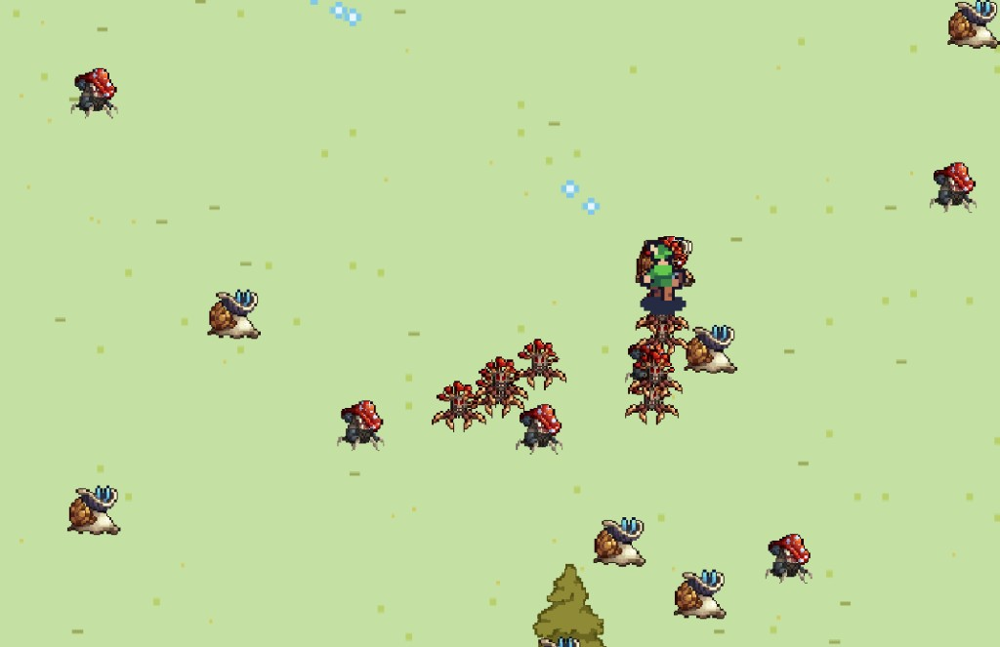
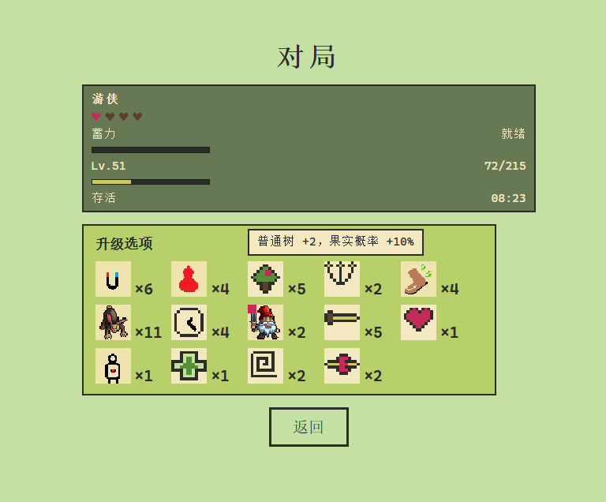

# 类幸存者

网页端 2D 俯视像素「类吸血鬼幸存者」肉鸽。操作游侠在大地图上生存、清怪、捡经验、选升级。

在线试玩：[https://tmddwyaaa-source.github.io/rogerlike/](https://tmddwyaaa-source.github.io/rogerlike/)（电脑浏览器，WASD + 鼠标蓄力）  
项目经历（可贴简历）：[项目经历.md](项目经历.md)





## 游戏设定

- **世界**：固定大地图（11000×11000），浅绿草地，镜头跟随角色。
- **角色**：仅可玩 **游侠**，武器为 **游侠弓**（无弹匣、无换弹）。WASD 移动，鼠标瞄准。
- **难度**：目前只有难度一。怪物随存活时间变多、变硬。
- **单位**：蘑菇怪、蜗牛怪、裂怪、史莱姆、灰树与普通树；可选跟班（地精、兔子）。

## 游戏目标

- **胜利**：存活 **600 秒（10 分钟）**。
- **失败**：生命归零。
- 过程：击杀与毁树掉经验结晶 → 升级三选一 → 越打越强，同时刷怪变密。

## 蓄力是什么

鼠标瞄准。**按住蓄力、松开发射**（蓄满约 **0.75 秒**）。两次射击间隔 **0.21 秒**。

| | 不蓄力（点射） | 蓄满 |
|--|----------------|------|
| 伤害 | 等于当前 **攻击**（开局 20） | **攻击 × 2** |
| 击退 | **1** 身位 | **2** 身位（可被怪物减免，最低 0） |
| 穿透 | 无基础穿透 | 基础可再穿 **1** 个；升级「穿透」每次再 +1 |

「技巧」减少蓄力时间，减到 0 后无需蓄力也会按满蓄规则射出。散射、开眼了等升级会加弹道，所以局内可能同时飞出很多箭，那是升级效果，不是蓄力本身变成全屏技能。

## 每升级 5 次的成长

按角色等级：到 **6 / 11 / 16…** 级时各触发一次（`floor((等级−1)/5)`）。

每次：**攻击 +1**，**移速 +0.05**（设计单位）。  
与三选一里的「力量」「敏捷」分开计算，会叠在一起。

另外每次升级仍会先播 **+1**，再从池里抽 3 个选项。

## 本地运行

```bash
cd frontend
npm install
npm run dev
```

打开 [http://localhost:5173/](http://localhost:5173/)。不启动后端也能玩。「回忆」存在当前浏览器，打完一局才有记录。

## 技术栈

| 部分 | 技术 |
|------|------|
| 游戏 | Vue 3、Vite、Canvas 2D |
| 统计 API（可选） | Spring Boot 3、Java 17、MyBatis-Plus、MySQL |

统计默认连 `http://localhost:8080/api`。后端没开时开局会忽略上报，不影响游玩。本机 MySQL 密码写在 `application-local.yml`（不进 Git）。

## 仓库结构

| 路径 | 说明 |
|------|------|
| `frontend/` | 可玩客户端 |
| `backend/` | 可选统计 API |
| `游戏当前设计表.md` | 当前玩法数值 |
| `docs/` | 规格、开发记录、本页截图 |

角色贴图来自 [Craftpix](https://craftpix.net/) 免费 Top-down Roguelike 像素包，公开分发请遵守其许可。

本项目仍会继续改玩法。当前公开版本是可玩停点，不是最终版。
